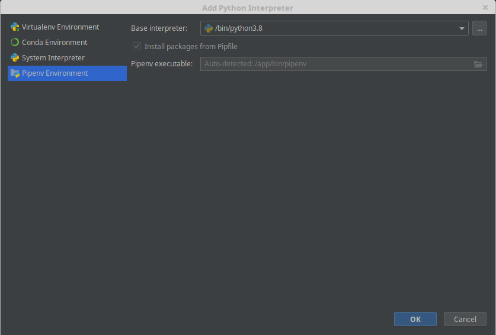

# *INSTRUCCIONES PARA EL DISFRUTE DE SPACE ROOM*

1- Descargar el entorno de desarrollo de software libre gratuito [PyCharm Community](https://www.jetbrains.com/es-es/pycharm/download)

2- Descomprimir archivo zip Juego Escape Room

3- Abrir la carpeta Juego Escape Room 

4- Abrir el archivo main.py dentro del entrono de desarrollo PyCharm

5- Añadir el interprete Pipenv Enviroment y pulsamos OK

6- Pulsar el botón Run

7- Disfrutar !!!!
